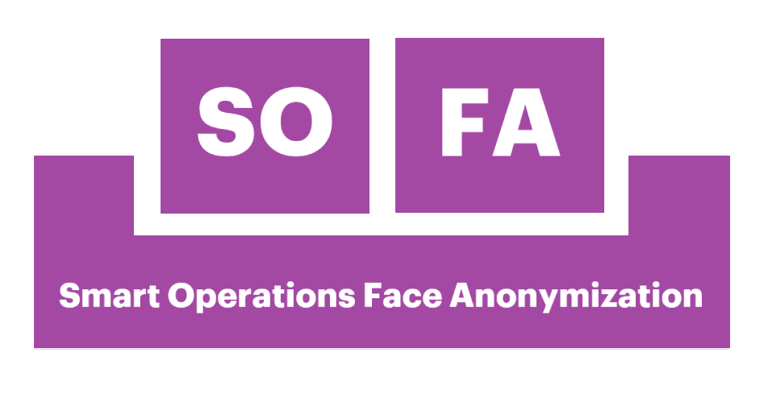

# Sofa

This is a minimalist tool for removing faces from a video, and removing clips
which the algorithm wasn't succesfull

<p align="center">
  
</p>


## Installation

### Windows

* Install 
* Install 

#### Dev version

* Download the file 
* unzip it
* run install.bat
* run sofa.bat

#### Release

* Download the file `releases\sofa_install.zip`
* run `sofaSetup.exe`

### Ubuntu

#### Dev version

If you are planning to play *MP4* or any other proprietary formats, you need
to install the following packages:

``` bash
$ sudo apt install ubuntu-restricted-extras
$ sudo apt install build-essential qt5-default
$ sudo apt install libgstreamer1.0-0 gstreamer1.0-plugins-base gstreamer1.0-plugins-good gstreamer1.0-plugins-bad gstreamer1.0-plugins-ugly gstreamer1.0-libav gstreamer1.0-doc gstreamer1.0-tools gstreamer1.0-x gstreamer1.0-alsa gstreamer1.0-gl gstreamer1.0-gtk3 gstreamer1.0-qt5 gstreamer1.0-pulseaudio
```

Then, install the required Python Libraries.
It is recommended to create a virtual environment for the application, instead
of installing it globally:

```bash
$ cd <project_dir>
$ python3 -m venv venv
$ source venv/bin/activate
$ pip install -U pip
$ pip install -r requirements.txt
```
